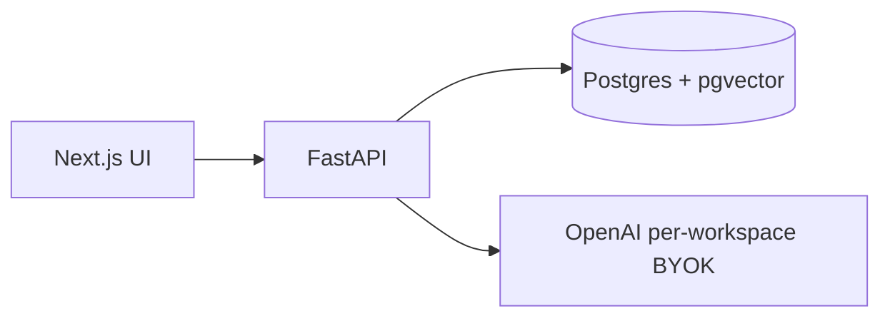

# Docutalk

Multi-tenant document Q&A built on retrieval-augmented generation (RAG). Users upload PDF, Markdown, or plain text, then ask natural-language questions grounded in their own files. Each workspace brings its own OpenAI API key — embeddings and chat run against the tenant's credentials, not a shared platform key.

## What it does

- **Ingest** — parse uploads, chunk text with overlap, embed via OpenAI, store vectors in Postgres
- **Retrieve** — cosine similarity search scoped strictly by `workspace_id`
- **Generate** — LLM answers from retrieved context only, with source citations
- **Isolate** — one user, one workspace (MVP); cross-tenant data access is blocked at the API and query layer

## Architecture



| Layer | Technology |
|-------|------------|
| Frontend | Next.js 15 (App Router), TypeScript, Tailwind CSS |
| API | FastAPI, Pydantic, async SQLAlchemy 2 |
| Database | PostgreSQL 16, pgvector, Alembic migrations |
| Auth | JWT (Bearer), bcrypt password hashing |
| LLM | OpenAI `text-embedding-3-small` + `gpt-4o-mini` |

### RAG pipeline

```
Upload → extract text → chunk (800 chars / 120 overlap)
      → embed (1536-dim vectors) → store in chunks table
Query  → embed question → pgvector HNSW search (WHERE workspace_id = ?)
      → top-k chunks → prompt LLM → answer + citations
```

### Multi-tenancy and security

- **Workspace isolation** — every `documents` and `chunks` row carries `workspace_id`; retrieval SQL always filters on it
- **BYOK encryption** — OpenAI keys encrypted at rest with AES-GCM; UI shows only `last4`
- **Key validation** — keys verified against OpenAI before persistence
- **Rate limiting** — per-IP middleware on mutating routes; per-workspace chat quota (60 req/hour)
- **Abuse caps** — 20 documents/workspace, 10 MB/file, 200 PDF pages

## API

| Method | Endpoint | Description |
|--------|----------|-------------|
| `POST` | `/auth/register` | Create account + personal workspace |
| `POST` | `/auth/login` | Issue JWT |
| `GET` | `/me` | Current user and workspace |
| `PUT` | `/workspaces/{id}/openai-key` | Save encrypted BYOK key |
| `POST` | `/workspaces/{id}/documents` | Upload and ingest |
| `GET` | `/workspaces/{id}/documents` | List documents |
| `DELETE` | `/workspaces/{id}/documents/{doc_id}` | Delete document + chunks |
| `POST` | `/workspaces/{id}/chat` | RAG question answering |
| `GET` | `/health` | Liveness + database check |

## Project structure

```
Docutalk/
├── backend/
│   ├── app/
│   │   ├── routers/          # auth, workspaces, documents, chat
│   │   ├── services/         # ingest, retrieve, generate, openai_client
│   │   ├── security/         # AES-GCM key encryption
│   │   └── models.py         # users, workspaces, documents, chunks
│   ├── alembic/              # migrations (pgvector extension + schema)
│   └── tests/                # crypto, chunking, tenant isolation
├── frontend/
│   └── src/
│       ├── app/              # landing, auth, dashboard, chat, settings
│       ├── components/       # shared nav
│       ├── lib/api.ts        # typed API client
│       └── styles/tokens.css # design system (CSS variables)
└── docker-compose.yml        # pgvector/pgvector:pg16
```

## Getting started

### Prerequisites

- Docker
- Python 3.12+
- Node.js 20+

### 1. Database

```bash
docker compose up -d
```

Postgres listens on host port **5433** (mapped from container 5432).

### 2. Backend

```bash
cd backend
python3 -m venv .venv
source .venv/bin/activate
pip install -r requirements.txt
cp ../.env.example .env        # set JWT_SECRET and DOCUTALK_SECRETS_KEY
alembic upgrade head
uvicorn app.main:app --reload --port 8000
```

### 3. Frontend

```bash
cd frontend
cp ../.env.example .env.local   # NEXT_PUBLIC_API_URL=http://localhost:8000
npm install
npm run dev
```

Open [http://localhost:3000](http://localhost:3000).

### 4. Walkthrough

1. Register — auto-provisions a personal workspace
2. **Settings** — add your OpenAI API key
3. **Documents** — upload a PDF, TXT, or Markdown file
4. **Chat** — ask a question; response includes cited source snippets

## Configuration

Copy `.env.example` and adjust:

| Variable | Purpose |
|----------|---------|
| `DATABASE_URL` | Async Postgres connection string |
| `JWT_SECRET` | Signs access tokens |
| `DOCUTALK_SECRETS_KEY` | AES key for encrypting BYOK secrets (32-byte hex) |
| `EMBEDDING_MODEL` | OpenAI embedding model (default `text-embedding-3-small`) |
| `CHAT_MODEL` | OpenAI chat model (default `gpt-4o-mini`) |
| `NEXT_PUBLIC_API_URL` | Frontend → backend base URL |

## Tests

```bash
cd backend
source .venv/bin/activate
pytest
```

Coverage includes AES round-trip, text chunking, pgvector retrieval scoping, and HTTP-level cross-workspace access denial.

## Design system

UI uses a custom purple-and-white metallic token set (`frontend/src/styles/tokens.css`) mapped into Tailwind. Preview swatches at `/dev/theme`.
